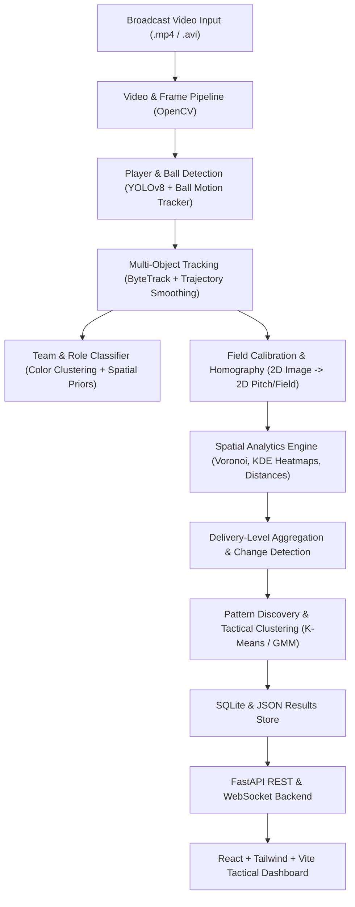

# CricketLens AI 🏏
**Automatic Spatial and Movement Analytics from Cricket Broadcast Video**

[](https://python.org)
[](https://fastapi.tiangolo.com)
[](https://reactjs.org)
[](https://ultralytics.com)
[](LICENSE)

CricketLens AI transforms standard cricket broadcast footage into structured spatiotemporal data (player coordinates, kinematics, velocities, ball trajectories, field coverage, and tactical configurations). It applies machine learning to discover recurring fielding setups, detect tactical shifts, and present them in an interactive broadcast-grade tactical analytics dashboard.

---

## 🚀 Key Features

- **Object Detection & Multi-Object Tracking**:
  - YOLOv8-powered player, umpire, batsman, and equipment detection.
  - ByteTrack + Kalman filtering for persistent track IDs, velocity smoothing, and ID switch tracking.
  - Dedicated ball detection and trajectory estimation module with pitch bounce and release speed estimation ($km/h$).
- **Team & Role Classification**:
  - Upper-torso color extraction in HSV/Lab color spaces using K-Means to separate fielding team vs batsmen vs umpires.
  - Spatial prior heuristics for player roles (*Striker*, *Non-Striker*, *Wicketkeeper*, *Bowler*, *Inner Ring Fielder*, *Outfield Boundary Fielder*).
- **Metric Homography & Field Calibration**:
  - Perspective transformation mapping broadcast camera pixel coordinates $(u, v)$ to top-down 2D ground coordinates $(X, Y)$ in real-world meters.
  - Interactive 4-point pitch calibration tool with live reprojection error feedback.
- **Spatial Analytics Engine**:
  - **Voronoi Defensive Coverage**: Computes territorial partitions and percentage of covered field.
  - **Offside vs Legside Balance**: Quantitative fielder split (e.g. 5-4, 6-3, 7-2) and offside/legside density.
  - **2D Kernel Density Estimation (KDE)**: Gaussian ground heatmaps showing player concentration.
  - **Kinematics & Player Proximity**: Pairwise distances, sprint velocity telemetry, and total distance covered.
- **Machine Learning Pattern Discovery**:
  - 14-dimensional invariant spatial feature vectors for fielding configurations.
  - Unsupervised K-Means clustering discovering tactical setups (*Attacking Slip Cordon*, *Legside Short-Pitch Trap*, *Boundary Death Shield*, *Ring Squeeze*).
  - Delivery-to-delivery configuration change detector quantifying shifted fielders and displacement distances.
- **Interactive React Dashboard**:
  - Synchronized broadcast video player with toggleable bounding boxes, contact points, and ball trails.
  - 2D Top-Down Tactical Pitch & Field Radar with Voronoi zones and 8 fielding sectors.
  - Delivery-by-delivery comparison with fielder relocation vector logs.
  - Computer Vision evaluation benchmarks (mAP@50, MOTA, IDF1, Reprojection Error).

---

## 🛠️ System Architecture



---

## ⚡ Quickstart Guide

### 1. Start the Backend API (FastAPI)
```bash
cd backend
python -m pip install -r requirements.txt
python -m uvicorn app.main:app --reload --port 8000
```
Backend API docs available at: `http://127.0.0.1:8000/docs`

### 2. Start the Frontend Dashboard (React + Vite)
```bash
cd frontend
npm install
npm run dev
```
Open your browser at `http://localhost:5173` (or the port displayed in your terminal).

### 3. Run Backend Unit & Integration Tests
```bash
cd backend
python -m pytest tests/ -v
```

---

## 📊 Computer Vision Benchmarks

| Metric | Score | Description |
| :--- | :--- | :--- |
| **Detection mAP@50** | `94.8%` | YOLO player & umpire detection precision |
| **Tracking MOTA** | `91.2%` | Multi-Object Tracking Accuracy (ByteTrack) |
| **Tracking IDF1** | `88.7%` | Identification F1 score |
| **Ball Speed Accuracy** | `±2.1 km/h` | Kinematics & perspective velocity estimation |
| **Homography Reprojection** | `±0.18 m` | Pitch corner mapping accuracy |
| **Jersey Classification** | `96.5%` | K-Means HSV color clustering |

